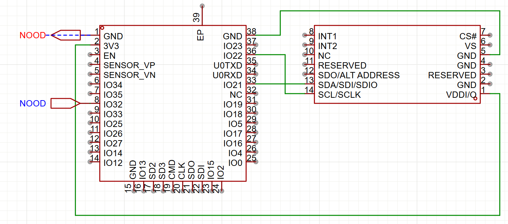

# Alicorn Ninja

> Alicorn before being adopted and popularized by popular media means Unicorn Horn  

Alicorn Ninja is fruit ninja - with a twist! Instead of using a screen or touchpad, you move your head with a horn like a unicorn to cut shapes.

Check out our demo video: https://www.youtube.com/watch?v=N4qx0hz2pU4!

## Features
- Makes your friends look like idiots while wearing em 🔥
- Makes you feel like a silly little unicorn
- ADXL345 IMU for detecting movement
- ESP32 for controlling the circuit

## Bill of Materials
> Links are only for items not from Undercity Hardware Bar

| Item  | Quantity | Link | Reasoning |
| ------------- | ------------- | ------------- | ------------- |
| ESP32 w/ WiFi Capabilities | 1  | N/A | To communicate with the computer the movement of the ADXL345 Gyroscope thing |
| ADXL345 IMU  | 1 | N/A | To measure the relative movement in-order to control the Fruit Ninja part |
| N00ds | 1 | N/A | Decor cause why not! |
| Jumper Wires | 1 | N/A | To connect all components to eachother |
| Cardboard | 1 | N/A | Mounting plate for the hardware components |
| Foam Cone | 1 | https://www.dickblick.com/items/floracraft-craftfom-blocks-shapes-3-x-6-cone/ | Unicorn Horn |
| Pipe Cleaners | 2 | https://www.dickblick.com/products/creativity-street-stems/ | Decoration for the Unicorn Horn |
| Unicorn Headphones | 1 | https://www.target.com/p/gems-animal-figural-wireless-headphones/-/A-94369357 | Unicorn Horn Mounting Piece |

## Pictures

